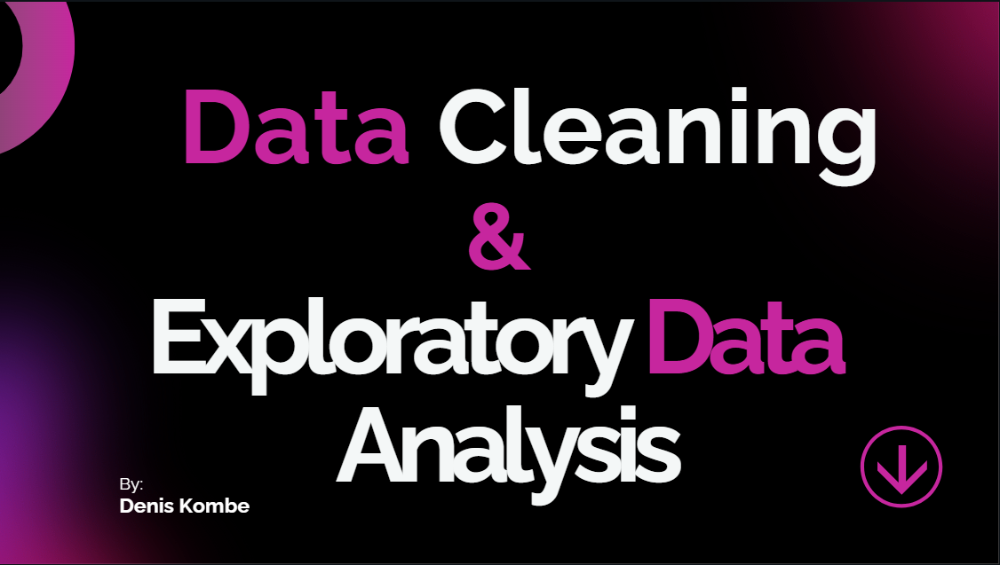

# Sales Analysis

- This repository contains the **Sales Analysis** project, which focuses on cleaning and analyzing sales data using SQL queries to derive actionable insights. The project is structured to showcase the complete data analysis process from cleaning to exploratory analysis. 
- This dataset contains detailed sales records for various products sold across multiple regions in Africa from January 1, 2022, to December 24, 2022. It includes columns such as CustomerID, OrderDate, Salesperson, ProductName, ProductCategory, Quantity, UnitPrice_In_Dollars, TotalPrice_In_Dollars, City, Country, and Sales Channel. Additionally, the dataset captures marketing spend, leads generated, and conversion rates for different sales channels, including TikTok, Facebook, YouTube, Instagram, and X_Twitter. The diverse product categories include items like Maasai Shuka, Kitenge Fabric, Aloe Vera, and African Hair Care Products. With its rich information, this dataset is ideal for analyzing sales performance, regional trends, marketing effectiveness, and customer behavior to derive actionable insights for decision-making and strategy.

## 📂 Repository Contents
- `data/`: Contains the raw and cleaned datasets in CSV format.
  - `sales_data3.csv`: The original dataset before cleaning.
  - `Final Cleaned_Sales_Datac1.csv`: The cleaned and processed dataset.
- `queries/`: Includes SQL scripts for analysis.
  - `Data Cleaning on sales data.sql`: SQL queries used for data cleaning.
  - `EDA.sql`: SQL queries used for exploratory data analysis.
- `documentation/`: Comprehensive PDF documents explaining the process and results.
  - `DATA CLEANING FINAL DOCUMENTATION.pdf`: Details the cleaning process with SQL queries.
  - `EDA Documentation..pdf`: Details the exploratory analysis process with SQL queries.
  - `THINGS_I_LEARNED_FROM_DATA_CLEANING_AND_EXPLORATORY_DATA_ANALYSIS[1].pdf`: Key insights and lessons learned from the analysis.

## 🛠️ Objectives
1. To clean and preprocess the dataset to ensure data accuracy and consistency.
2. To perform exploratory data analysis (EDA) to uncover trends, patterns, and insights.
3. To document the findings and share lessons learned for educational and collaborative purposes.
- Find more objectives in the two PDF files in the `Documentation`.

## 🔍 Key Insights
- *The top product was “Maasai Shuka” with 1684485 total sales. While the top product category was “African Hair Products” with 4039956 total sales.*
- *The top Country in terms of sales was “Angola” while the top City was “Luanda”.*
- *The dataset used, the top channel based on leads generated was “TikTok”.
- *The top channel based on total sales was “TikTok” with 1562926 sales.*
- *The top channel based on conversion rate was “Facebook” with a conversion rate of 0.9.*
- *The best salesperson was “Bob Johnson” with a total sale of 2068550.*


## 🚀 How to Use
1. Clone the repository:
   ```bash
   git clone https://github.com/your-username/Sales_Analysis.git
2. Import the raw dataset into a SQL database (e.g., MySQL Workbench).
3. Run the SQL scripts in the queries/ folder in the following order:
   - Start with `Data Cleaning on sales data.sql` to clean the data.
   - Run `EDA.sql` for exploratory analysis.
